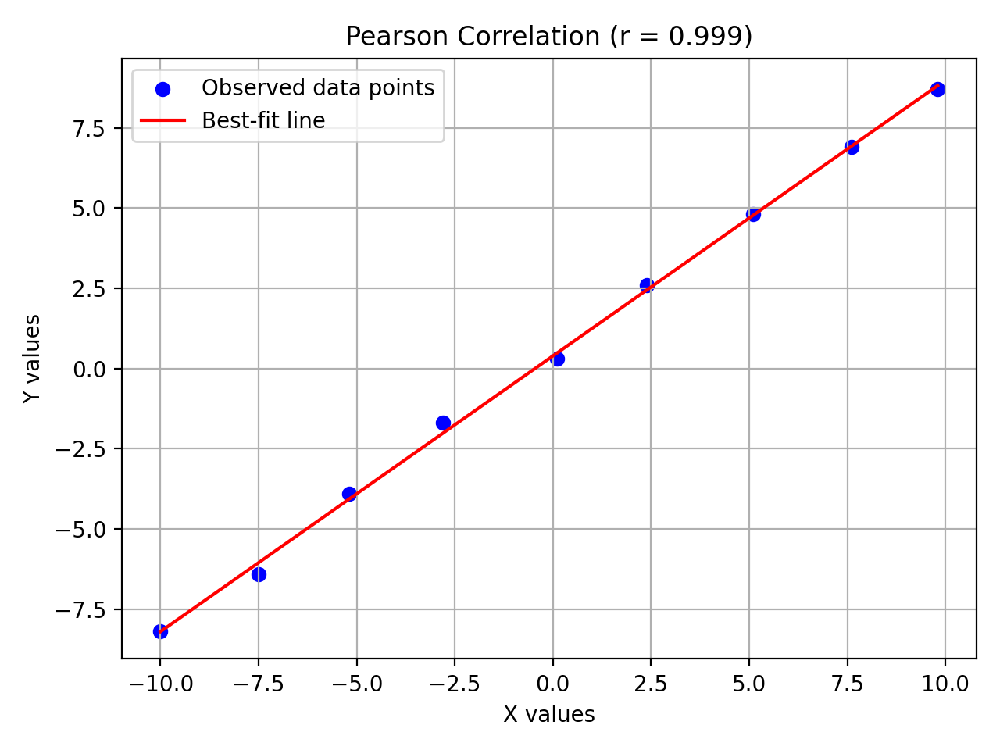
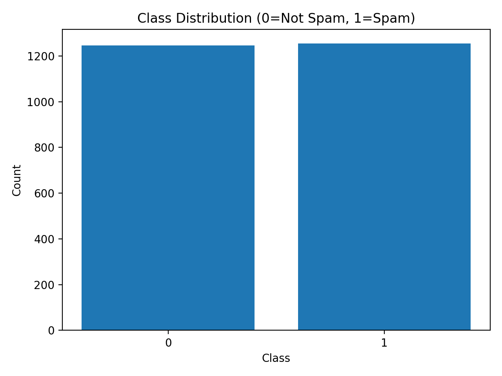
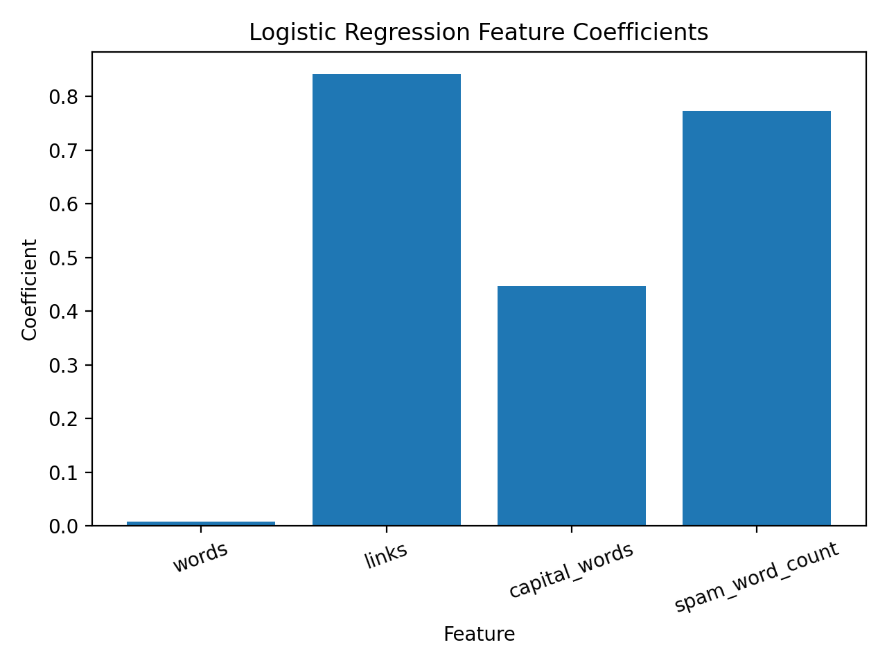
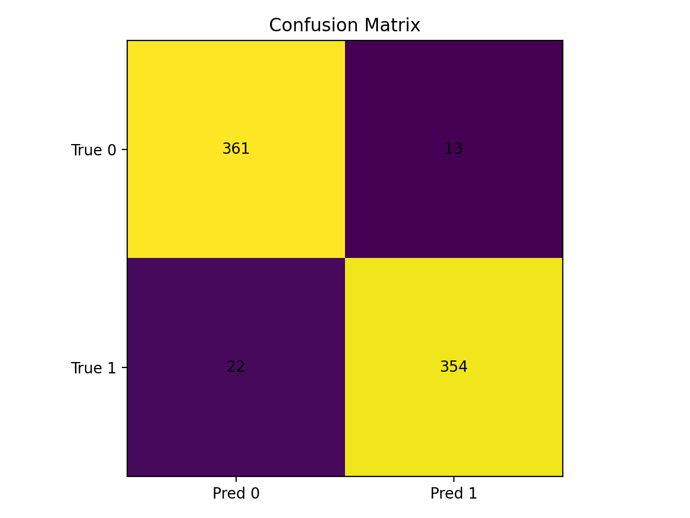

# aimlmid2026_g_mikadze2024

# AI and ML for Cybersecurity — Midterm Exam (Jan 9, 2026)

Repository: **aimlmid2026_g_mikadze2024**

---

## 1) Finding the Correlation (Pearson)

### Data collection
The data was obtained from the interactive graph available at:

**http://max.ge/aiml_midterm/46829_html/g_mikadze2024_46829.html**

The blue data points were collected manually by hovering the mouse over each point on the graph and recording the displayed (x, y) coordinates.  
In total, **9 data points** were collected and saved in:

- `correlation/points.csv`

---

### Collected data points
The following coordinates were extracted from the graph:

(-10.0, -8.20)
(-7.50, -6.40)
(-5.20, -3.90)
(-2.80, -1.70)
(0.10, 0.30)
(2.40, 2.60)
(5.10, 4.80)
(7.60, 6.90)
(9.80, 8.70)

---

### Method
To evaluate the linear relationship between variables X and Y, Pearson’s correlation coefficient was calculated using the following formula:

r = Σ((xi − x̄)(yi − ȳ)) / √( Σ(xi − x̄)² · Σ(yi − ȳ)² )

The formula was implemented directly in Python (without using built-in correlation shortcuts).

---

### Code
- `correlation/correlation.py`

---

### Result
The computed **Pearson correlation coefficient** is:

**r = 0.99943**

This value indicates an **extremely strong positive linear correlation** between X and Y.

---

### Visualization
The scatter plot below includes the observed data points and the best-fit regression line:



---

## 2) Spam Email Detection (Logistic Regression)

### Dataset
The dataset used for spam email detection was provided at:

http://max.ge/aiml_midterm/g_mikadze2024_46829_csv

The dataset contains numerical features extracted from emails and a class label
indicating whether an email is **spam** or **legitimate**.

The dataset file was uploaded to this repository:

- `spam/g_mikadze2024_46829.csv`

---

### Features
Each email in the dataset is represented by the following numerical features:

- **words** – total number of words in the email  
- **links** – number of URLs contained in the email  
- **capital_words** – number of words written in all capital letters  
- **spam_word_count** – number of known spam-related keywords appearing in the email  

The target label is:

- **is_spam** – 1 indicates spam, 0 indicates legitimate email

---

### Model and Training

The logistic regression model is instantiated and trained programmatically using the `fit()` method inside `spam/spam_detector.py`.

A **Logistic Regression** classifier was implemented using the `scikit-learn` library.

The dataset was split into training and testing subsets using a **70% / 30% split** with stratification to preserve class balance.

- Training data: 70%
- Testing data: 30%

The model was trained using the following source code:

- `spam/spam_detector.py`

---
### Data Loading and Processing
The dataset is loaded using the pandas library (`pd.read_csv`).  
Feature columns (`words`, `links`, `capital_words`, `spam_word_count`) are selected as input variables, while the `is_spam` column is used as the target label.  
The dataset is split into training and testing sets using `train_test_split` with stratification to preserve the original class distribution.

### Model Coefficients
After training, the logistic regression model produced the following parameters:

- **Intercept:** `-9.37996`

- **Feature coefficients:**
  - words: `0.00793`
  - links: `0.84137`
  - capital_words: `0.44723`
  - spam_word_count: `0.77279`

These coefficients indicate that the presence of **links**, **capitalized words**, and **spam-related keywords** has the strongest influence on classifying an email as spam.

---

### Model Evaluation
The trained model was evaluated on the test dataset (30% hold-out set).

**Confusion Matrix (Actual x Predicted):**
```
[[361 13]
[ 22 354]]
```

- True Negatives: 361  
- False Positives: 13  
- False Negatives: 22  
- True Positives: 354  

**Accuracy:**

0.9533 (95.33%)


This indicates that the model performs very well in distinguishing spam from legitimate emails.

---
### Evaluation Method
Model evaluation is performed using the test subset (30% of the data).  
Predicted labels are generated using the trained logistic regression model and compared with true labels to compute the confusion matrix and accuracy using `confusion_matrix()` and `accuracy_score()` from `scikit-learn`.


### Visualizations

All visualizations were generated programmatically in Python using the `matplotlib` library.  
The plotting code is implemented in `spam/spam_detector.py`, where figures are saved automatically into the `spam/outputs/` directory.

#### 1) Class Distribution
The following plot shows the distribution of spam (1) and non-spam (0) emails in the dataset.



**Explanation:**  
The dataset is well balanced, with a similar number of spam and legitimate emails. This balance helps prevent bias during model training.

---

#### 2) Logistic Regression Feature Coefficients
The bar chart below visualizes the relative importance of each feature in the logistic regression model.



**Explanation:**  
The number of links and spam keyword occurrences are the most influential indicators of spam emails, while the total word count has minimal impact.

---

#### 3) Confusion Matrix Visualization
The confusion matrix below provides a graphical view of model predictions versus actual labels.



**Explanation:**  
Most predictions fall along the diagonal, showing a high number of correct classifications and relatively few misclassifications.

---

### Email Classification from Raw Text
The application supports classifying **raw email text** entered by the user.

The email text is parsed and the same four features are extracted before applying the trained model.

---

### Example Spam Email

URGENT!!! YOU ARE A WINNER!!!
Claim your FREE cash prize now.
Click https://free-prize.example
 to receive your BONUS offer.


**Explanation:**  
This email contains multiple spam indicators such as:
- Spam keywords (free, winner, cash, bonus)
- Capitalized words
- Embedded link

The model correctly classifies this email as **spam**.

---

### Example Legitimate Email

Hello team,
Please find attached the meeting notes from today.
Let me know if you have any questions.
Best regards.


**Explanation:**  
This email does not contain spam keywords, links, or excessive capitalization and is correctly classified as **legitimate**.

---

### How to Run the Program

From the repository root directory:

```bash
cd spam
python spam_detector.py
```

## Conclusion
This project demonstrates the application of statistical analysis and machine learning techniques in cybersecurity contexts.
Pearson correlation analysis confirmed a strong linear relationship between the given variables, while the logistic regression model successfully classified spam emails with high accuracy using interpretable numerical features.

## Author
**Grigol Mikadze**
AI and ML for Cybersecurity — Midterm Exam
January 9, 2026